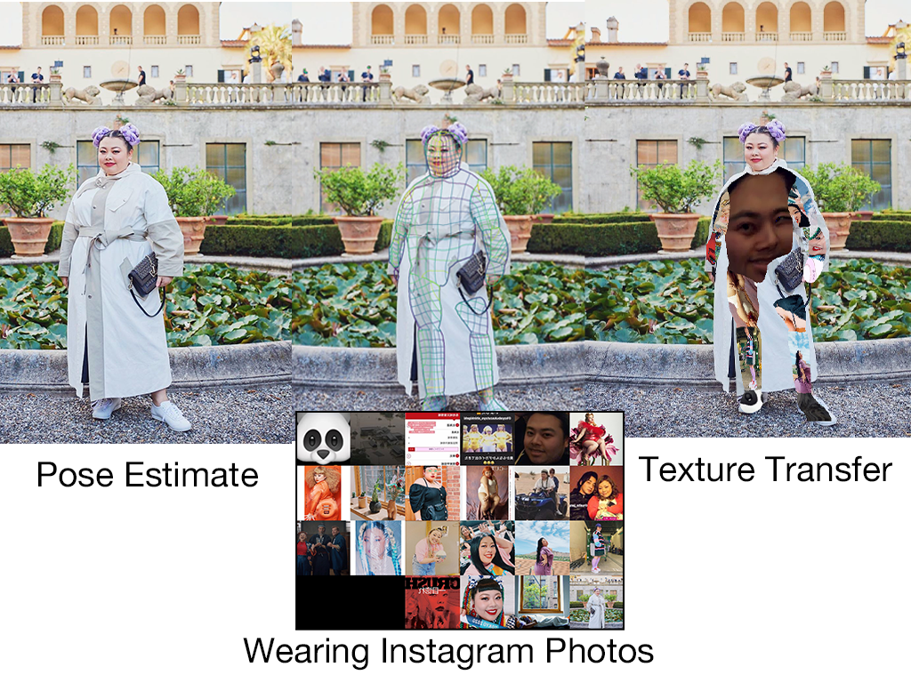

# MemoryBody [](https://colab.research.google.com/drive/1WBZFEepFX2TwEHLXWO-ShEC2KhnTcpL2#scrollTo=kRPMYQRmJesJ)

A project at computational creativity lab summer camp hackathon 2019


## Introduction/Concept

As a memory, data of the past posts on SNS binds the person's own identity, behavior and the next post. We bring out the situation by make a user wear its past SNS posts data.



## Materials / Methods / Implementation

samples on [Google Colab](https://colab.research.google.com/drive/1WBZFEepFX2TwEHLXWO-ShEC2KhnTcpL2)

### Get Instagram Image for Texture

```shell
$ python get_instagram_images.py
put your instagram user name:watanabenaomi703
Now downloading picture 0...
Now downloading picture 1...
Now downloading picture 2...
Now downloading picture 3...
Now downloading picture 4...
Now downloading picture 5...
Now downloading picture 6...
Now downloading picture 7...
Now downloading picture 8...
Now downloading picture 9...
Now downloading picture 10...
Now downloading picture 11...
Now downloading picture 12...
Now downloading picture 13...
Now downloading picture 14...
Now downloading picture 15...
Now downloading picture 16...
Now downloading picture 17...
Now downloading picture 18...
Now downloading picture 19...
Now downloading picture 20...
Now downloading picture 21...
Saved your img file for Texture
```

